# AINL Marketplace — AWS Architecture Design

**Document Version:** 1.0  
**Status:** Design Review  
**Prepared For:** Steven / Senior AWS Architect Review  
**Last Updated:** 2026-03-30  

---

## Table of Contents

1. [Overview](#overview)
2. [Design Principles](#design-principles)
3. [Architecture Diagram](#architecture-diagram)
4. [Services & Components](#services--components)
   - [Frontend](#frontend)
   - [Auth & Wallet Verification](#auth--wallet-verification)
   - [Marketplace API](#marketplace-api)
   - [Graph Storage](#graph-storage)
   - [Token Gating](#token-gating)
   - [Revenue & Payments](#revenue--payments)
   - [Monitoring & Security](#monitoring--security)
5. [DynamoDB Schema](#dynamodb-schema)
6. [Cost Estimate](#cost-estimate)
7. [Security Considerations](#security-considerations)
8. [Deployment Strategy](#deployment-strategy)

---

## Overview

The AINL Marketplace is a token-gated, decentralized-identity-aware platform built on AWS that enables AI graph creators to publish, monetize, and distribute `.ainl` graph files. Access to the marketplace and individual graphs is governed by on-chain $AINL token holdings, with all payments and revenue distribution handled via Solana wallets.

The platform is designed as a **serverless-first, cloud-native application** on AWS. It integrates Solana blockchain verification (token balance checks and wallet signature proofs) with standard AWS managed services for identity, storage, compute, and observability. The result is a low-operational-overhead system capable of scaling from hundreds to hundreds of thousands of monthly active users (MAU) without architectural changes.

**Key capabilities:**
- Token-gated access: minimum 1,000,000 $AINL required to participate
- Graph marketplace: list, browse, publish, and purchase `.ainl` AI graphs
- On-chain payment flow: $AINL transfers handled client-side, verified by Lambda webhooks
- Revenue split enforced at the application layer: 70% creator / 20% treasury / 10% burn
- Presigned S3 URLs for secure, time-limited graph file downloads

---

## Design Principles

| Principle | Implementation |
|---|---|
| **Serverless-first** | Lambda + API Gateway + DynamoDB; no EC2 instances or managed containers unless required |
| **Scalable** | DynamoDB on-demand capacity, Lambda concurrency auto-scales, CloudFront CDN |
| **Secure** | WAF on all public surfaces, Secrets Manager for credentials, Cognito for identity, wallet sig verification |
| **Cost-efficient** | Pay-per-request DynamoDB, Lambda pricing by invocation, S3 lifecycle policies |
| **Observable** | CloudWatch Logs, Metrics, Alarms, X-Ray tracing end-to-end |
| **Auditable** | CloudTrail for all API/management events, DynamoDB TTL for grant expiry |
| **Blockchain-agnostic boundary** | AWS handles all off-chain state; Solana RPC calls are isolated in dedicated Lambda functions |

---

## Architecture Diagram

```mermaid
graph TB
    subgraph Client["Client (Browser / Wallet Adapter)"]
        UI[Marketplace UI\nReact/Next.js SPA]
        WA[Solana Wallet Adapter\nPhantom / Backpack]
    end

    subgraph DNS_CDN["DNS & CDN Layer"]
        R53[Route 53\nainativelangcloud.com]
        CF[CloudFront\nDistribution]
        ACM[ACM SSL Certificate]
    end

    subgraph Frontend_Hosting["Frontend Hosting"]
        S3_UI[S3 Bucket\nStatic Assets]
    end

    subgraph Auth_Layer["Auth & Wallet Verification"]
        APIGW_AUTH[API Gateway\n/auth/*]
        COGNITO[Cognito User Pool\nJWT Issuer]
        L_WALLET[Lambda\nverify-wallet-signature]
        L_BALANCE[Lambda\ncheck-ainl-balance]
        SOL_RPC[Solana RPC\nMainnet-Beta]
    end

    subgraph API_Layer["Marketplace API"]
        APIGW_MKT[API Gateway\n/api/*]
        L_GRAPHS[Lambda\nlist-graphs / get-graph]
        L_PUBLISH[Lambda\npublish-graph]
        L_PURCHASE[Lambda\npurchase-access]
        L_ACCESS[Lambda\ncheck-access]
        L_WEBHOOK[Lambda\ntx-webhook-listener]
    end

    subgraph Storage_Layer["Storage"]
        DDB_GRAPHS[(DynamoDB\nGraphs Table)]
        DDB_USERS[(DynamoDB\nUsers Table)]
        DDB_ACCESS[(DynamoDB\nAccess Grants Table)]
        DDB_TX[(DynamoDB\nTransactions Table)]
        S3_GRAPHS[S3 Bucket\n.ainl Graph Files\nVersioning Enabled]
    end

    subgraph Config["Config & Secrets"]
        SSM[Parameter Store\nTreasury Wallet Address]
        SM[Secrets Manager\nAPI Keys / RPC Secrets]
    end

    subgraph Security["Security & Observability"]
        WAF[AWS WAF\nRate Limiting + Rules]
        CW[CloudWatch\nLogs + Metrics + Alarms]
        XRAY[AWS X-Ray\nDistributed Tracing]
        CT[CloudTrail\nAudit Log]
    end

    subgraph VPC["VPC (Isolated Lambdas)"]
        L_BALANCE_VPC[Lambda\ncheck-ainl-balance\nin VPC]
        L_WALLET_VPC[Lambda\nverify-wallet-signature\nin VPC]
    end

    %% DNS & CDN
    UI --> R53
    R53 --> CF
    CF --> ACM
    CF --> S3_UI
    CF --> APIGW_AUTH
    CF --> APIGW_MKT

    %% WAF sits in front of CloudFront and API Gateway
    WAF --> CF
    WAF --> APIGW_AUTH
    WAF --> APIGW_MKT

    %% Auth flow
    WA --> APIGW_AUTH
    APIGW_AUTH --> COGNITO
    APIGW_AUTH --> L_WALLET
    APIGW_AUTH --> L_BALANCE
    L_WALLET --> L_WALLET_VPC
    L_BALANCE --> L_BALANCE_VPC
    L_WALLET_VPC --> SOL_RPC
    L_BALANCE_VPC --> SOL_RPC
    L_WALLET_VPC --> SM
    L_BALANCE_VPC --> SM

    %% Marketplace API
    APIGW_MKT --> L_GRAPHS
    APIGW_MKT --> L_PUBLISH
    APIGW_MKT --> L_PURCHASE
    APIGW_MKT --> L_ACCESS
    APIGW_MKT --> L_WEBHOOK

    %% Lambda <-> Storage
    L_GRAPHS --> DDB_GRAPHS
    L_GRAPHS --> DDB_ACCESS
    L_PUBLISH --> DDB_GRAPHS
    L_PUBLISH --> S3_GRAPHS
    L_PURCHASE --> DDB_ACCESS
    L_PURCHASE --> DDB_TX
    L_PURCHASE --> L_BALANCE_VPC
    L_ACCESS --> DDB_ACCESS
    L_ACCESS --> S3_GRAPHS
    L_WEBHOOK --> DDB_TX
    L_WEBHOOK --> DDB_ACCESS
    L_WEBHOOK --> SSM

    %% Config
    L_PURCHASE --> SSM
    L_WEBHOOK --> SM

    %% Observability
    L_GRAPHS --> CW
    L_PUBLISH --> CW
    L_PURCHASE --> CW
    L_ACCESS --> CW
    L_WEBHOOK --> CW
    APIGW_MKT --> XRAY
    APIGW_AUTH --> XRAY
    CF --> CT
    APIGW_MKT --> CT
```



---

## Services & Components

### Frontend

The marketplace UI is a single-page application (React/Next.js) built and deployed as static assets.

#### S3 — Static Hosting

- **Bucket:** `ainl-marketplace-ui-prod`
- Versioning enabled; old deployments retained for rollback
- No direct public access — all traffic routed through CloudFront
- Bucket policy denies all direct S3 access; only CloudFront OAC (Origin Access Control) allowed

#### CloudFront — CDN & Edge

- **Distribution:** `ainativelangcloud.com` + `www.ainativelangcloud.com`
- Origins:
  - S3 bucket (UI assets) via OAC
  - API Gateway (auth endpoints) via custom origin
  - API Gateway (marketplace API) via custom origin
- Cache behaviors:
  - `/` and `/assets/*` — long-lived cache (1 year, cache-busted via hashed filenames)
  - `/api/*` and `/auth/*` — no cache (TTL = 0), forwarded to API Gateway
- Geo-restriction: configurable per compliance requirements
- Compress: enabled (gzip/brotli)
- HTTP/2 and HTTP/3 enabled
- WAF WebACL attached

#### Route 53 — DNS

- Hosted zone: `ainativelangcloud.com`
- A/AAAA alias records pointing to CloudFront distribution
- Records:
  ```
  ainativelangcloud.com        A    ALIAS → CloudFront
  www.ainativelangcloud.com    A    ALIAS → CloudFront
  api.ainativelangcloud.com    A    ALIAS → CloudFront (routes to API Gateway origin)
  ```

#### ACM — SSL/TLS

- Certificate issued in `us-east-1` (required for CloudFront)
- Covers `ainativelangcloud.com` and `*.ainativelangcloud.com`
- Auto-renews via DNS validation against Route 53

---

### Auth & Wallet Verification

Authentication is a two-phase flow: AWS Cognito handles traditional JWT identity, while a custom Lambda layer verifies Solana wallet ownership and $AINL token balance.

#### Flow Diagram

```
1. User connects Solana wallet (client-side)
2. Client requests a challenge nonce  → POST /auth/nonce
3. Lambda returns signed nonce string
4. User signs nonce with wallet        (client-side, wallet adapter)
5. Client submits signed nonce         → POST /auth/verify-wallet
6. Lambda verifies signature           (ed25519 verification)
7. Lambda checks $AINL balance         (Solana RPC call)
8. If ≥ 1,000,000 $AINL → Cognito issues JWT
9. JWT used for all subsequent API calls
```

#### Cognito User Pool

- **Pool ID:** `ainl-marketplace-users`
- Custom attributes:
  - `custom:wallet_address` (Solana public key, immutable after set)
  - `custom:token_verified` (boolean, updated by Lambda post-balance check)
  - `custom:last_balance_check` (Unix timestamp)
- Auth flow: `CUSTOM_AUTH` (Lambda triggers handle the wallet challenge/response)
- Token expiry: Access token 1 hour, Refresh token 30 days
- MFA: Optional TOTP for high-value creator accounts

#### Lambda: `verify-wallet-signature`

- **Runtime:** Node.js 20.x
- **Trigger:** API Gateway `POST /auth/verify-wallet`
- **Purpose:** Verify that the submitted Solana wallet signature is valid for the nonce
- **Logic:**
  1. Retrieve nonce from DynamoDB (nonces table, TTL = 5 minutes)
  2. Reconstruct message bytes from nonce
  3. Use `@solana/web3.js` `nacl.sign.detached.verify()` for ed25519 signature verification
  4. On success, delete nonce from DynamoDB (one-time use)
  5. Trigger balance check Lambda
- **IAM:** Least-privilege; DynamoDB read/delete on nonces table, invoke Lambda
- **VPC:** Yes — isolated subnet, no public IP, egress via NAT Gateway

#### Lambda: `check-ainl-balance`

- **Runtime:** Node.js 20.x
- **Trigger:** Internal invoke from `verify-wallet-signature` or direct API call
- **Purpose:** Verify wallet holds ≥ 1,000,000 $AINL tokens
- **Token Mint:** `56hrCR3n7danhHNjWaU4VeUHpE1eRE9VRBWpHRPKpump`
- **Logic:**
  1. Retrieve Solana RPC endpoint from Secrets Manager
  2. Call `getTokenAccountsByOwner` with the wallet address and $AINL mint
  3. Sum all token account balances
  4. Compare against minimum threshold (1,000,000 × 10^decimals)
  5. Return `{ eligible: true/false, balance: number }`
- **IAM:** Secrets Manager read for RPC endpoint, DynamoDB write for caching balance
- **VPC:** Yes — isolated, outbound to Solana RPC only via NAT

#### API Gateway — Auth Endpoints

- **Type:** HTTP API (v2) for lower latency
- **Base path:** `/auth`
- **Endpoints:**

| Method | Path | Lambda | Auth |
|---|---|---|---|
| POST | /auth/nonce | `generate-nonce` | None |
| POST | /auth/verify-wallet | `verify-wallet-signature` | None |
| GET | /auth/balance | `check-ainl-balance` | Cognito JWT |
| POST | /auth/refresh-access | `refresh-token-grant` | Cognito JWT |

- **CORS:** Allowed origin `https://ainativelangcloud.com`
- **Throttling:** 100 req/s burst, 50 req/s steady per route

---

### Marketplace API

All marketplace operations are exposed via a single API Gateway (HTTP API v2) backed by purpose-built Lambda functions. All routes require a valid Cognito JWT.

#### API Gateway — Marketplace

- **Type:** HTTP API (v2)
- **Base path:** `/api/v1`
- **Authorizer:** Cognito JWT authorizer on all routes
- **Stage:** `prod`, `staging`
- **Custom domain:** `api.ainativelangcloud.com` via Route 53 → CloudFront → API Gateway

#### Endpoints

| Method | Path | Lambda | Description |
|---|---|---|---|
| GET | /api/v1/graphs | `list-graphs` | Paginated list of published graphs |
| GET | /api/v1/graphs/{graphId} | `get-graph` | Graph metadata by ID |
| POST | /api/v1/graphs | `publish-graph` | Publish new graph (token gated) |
| PUT | /api/v1/graphs/{graphId} | `update-graph` | Update graph metadata |
| DELETE | /api/v1/graphs/{graphId} | `delete-graph` | Soft-delete graph |
| POST | /api/v1/graphs/{graphId}/purchase | `purchase-access` | Initiate purchase flow |
| GET | /api/v1/graphs/{graphId}/access | `check-access` | Check access & return presigned URL |
| POST | /api/v1/webhooks/transaction | `tx-webhook-listener` | On-chain transaction confirmation |

#### Lambda: `list-graphs`

- Queries `Graphs` DynamoDB table using GSI on `status = PUBLISHED`
- Supports cursor-based pagination via `LastEvaluatedKey`
- Optional filters: category, creator wallet, price range
- Response cached at CloudFront for 60 seconds (public listings)

#### Lambda: `get-graph`

- Fetches single graph record by `graphId`
- Returns metadata only (no download URL unless access verified)
- Increments view counter via DynamoDB atomic update

#### Lambda: `publish-graph`

- Validates creator holds ≥ 1,000,000 $AINL (calls `check-ainl-balance`)
- Accepts graph metadata + S3 presigned upload URL request
- Creates record in `Graphs` table with status `PENDING_UPLOAD`
- Returns presigned S3 PUT URL (expires 1 hour)
- S3 event notification on upload triggers status update to `PUBLISHED`

#### Lambda: `purchase-access`

- Validates buyer access eligibility (token gate check)
- Creates a pending `Transactions` record
- Returns treasury wallet address + expected payment amount in $AINL
- Client executes on-chain transfer; webhook confirms

#### Lambda: `check-access`

- Queries `AccessGrants` table for `(userId, graphId)` pair
- Validates TTL not expired
- If access valid: generates S3 presigned GET URL (15-minute expiry)
- Returns presigned URL for graph file download

#### Lambda: `tx-webhook-listener`

- Receives confirmed transaction payload (from on-chain indexer or client-side broadcast)
- Verifies transaction on Solana RPC (signature confirmation)
- Validates amount matches expected payment for the graph
- Updates `Transactions` table to `CONFIRMED`
- Creates `AccessGrants` record with TTL (configurable: lifetime or time-limited)
- Emits CloudWatch metric for revenue tracking

---

### Graph Storage

#### S3 Bucket: `ainl-graphs-prod`

- **Purpose:** Store all `.ainl` graph files
- **Versioning:** Enabled — every upload creates a new version; old versions retained for 90 days then archived to Glacier
- **Access:** Private — no public access whatsoever
- **Encryption:** SSE-S3 (AES-256) at rest; in-transit via HTTPS only
- **Lifecycle policy:**
  - Current versions: S3 Standard
  - Non-current versions: transition to S3 Glacier Instant Retrieval after 90 days
  - Delete non-current versions after 365 days

#### Presigned URL Flow

```
1. User calls GET /api/v1/graphs/{graphId}/access
2. Lambda checks AccessGrants DynamoDB table
3. If access valid → Lambda calls s3.getSignedUrl('getObject', { Expires: 900 })
4. Returns URL to client (15-minute window)
5. Client downloads .ainl file directly from S3
6. URL expires; no further access without re-checking access grant
```

- Presigned URLs are **never cached** — generated fresh per request
- Lambda execution role has `s3:GetObject` only on `ainl-graphs-prod` bucket
- S3 bucket policy enforces `aws:SecureTransport` (HTTPS only)

#### S3 Bucket Policy (excerpt)

```json
{
  "Version": "2012-10-17",
  "Statement": [
    {
      "Sid": "DenyNonHTTPS",
      "Effect": "Deny",
      "Principal": "*",
      "Action": "s3:*",
      "Resource": "arn:aws:s3:::ainl-graphs-prod/*",
      "Condition": {
        "Bool": { "aws:SecureTransport": "false" }
      }
    },
    {
      "Sid": "AllowLambdaPresignedAccess",
      "Effect": "Allow",
      "Principal": { "AWS": "arn:aws:iam::ACCOUNT_ID:role/ainl-check-access-lambda-role" },
      "Action": "s3:GetObject",
      "Resource": "arn:aws:s3:::ainl-graphs-prod/*"
    },
    {
      "Sid": "AllowLambdaPublishAccess",
      "Effect": "Allow",
      "Principal": { "AWS": "arn:aws:iam::ACCOUNT_ID:role/ainl-publish-graph-lambda-role" },
      "Action": ["s3:PutObject", "s3:GetObject"],
      "Resource": "arn:aws:s3:::ainl-graphs-prod/*"
    }
  ]
}
```

---

### Token Gating

Token gating is the enforcement mechanism that restricts marketplace access to wallets holding ≥ 1,000,000 $AINL tokens.

#### Token Mint Address

```
56hrCR3n7danhHNjWaU4VeUHpE1eRE9VRBWpHRPKpump
```

#### Verification Logic

```
1. Extract wallet address from Cognito JWT (custom:wallet_address)
2. Call Solana RPC: getTokenAccountsByOwner(walletAddress, { mint: AINL_MINT })
3. Sum all token account amounts (account for decimals)
4. If sum ≥ 1,000,000 * (10^decimals) → eligible
5. Cache result in Users DynamoDB table (TTL: 1 hour)
6. If cached and not expired → return cached result (skip RPC call)
```

#### Cache Strategy

Token balances are cached in DynamoDB to avoid hitting Solana RPC on every API call:

- Cache TTL: 1 hour for eligible users, 5 minutes for ineligible users
- Cache invalidated on explicit `/auth/refresh-access` call
- Cached field: `Users.tokenBalance`, `Users.tokenVerifiedAt`

#### Access Grant Storage

Access grants (after purchase) are stored in `AccessGrants` DynamoDB table:

- TTL field: `expiresAt` (Unix timestamp)
- Access type: `LIFETIME` or `TIMED` (set by graph creator at publish time)
- For lifetime access: TTL set to year 2099 (effectively permanent)
- DynamoDB TTL automatic deletion handles grant expiry

---

### Revenue & Payments

All financial transactions are on-chain; AWS serves as the off-chain state layer for access control.

#### Payment Flow

```
1. Buyer initiates purchase: POST /api/v1/graphs/{graphId}/purchase
2. API returns: { treasuryWallet, amount, graphId, txNonce }
3. Buyer wallet adapter constructs Solana transaction:
   - Transfer `amount` $AINL to `treasuryWallet`
   - Include `txNonce` in transaction memo field
4. Transaction signed and broadcast by client wallet adapter
5. Client polls for confirmation, then calls:
   POST /api/v1/webhooks/transaction { txSignature, graphId, buyerWallet }
6. Lambda verifies tx on-chain (Solana RPC `getTransaction`)
7. Validates: amount correct, recipient = treasury wallet, memo = txNonce
8. On success: create AccessGrant, update Transaction to CONFIRMED
```

#### Revenue Split

The 70/20/10 split is enforced off-chain at the treasury distribution layer. On-chain, the buyer pays the full amount to the treasury wallet. Distribution is handled by a separate scheduled Lambda (not part of the real-time flow):

| Recipient | Percentage | Mechanism |
|---|---|---|
| Graph Creator | 70% | Batched $AINL transfer from treasury to creator wallet (daily settlement) |
| Treasury | 20% | Retained in treasury wallet |
| Burn | 10% | Sent to Solana burn address (`11111111111111111111111111111111`) |

- Treasury wallet address stored in Parameter Store: `/ainl/treasury/wallet_address`
- Settlement Lambda runs daily via EventBridge scheduler
- All settlement transactions logged to `Transactions` DynamoDB table

#### Parameter Store

```
/ainl/treasury/wallet_address    → treasury Solana wallet public key
/ainl/token/mint_address         → 56hrCR3n7danhHNjWaU4VeUHpE1eRE9VRBWpHRPKpump
/ainl/token/min_balance          → 1000000
/ainl/revenue/creator_pct        → 70
/ainl/revenue/treasury_pct       → 20
/ainl/revenue/burn_pct           → 10
```

#### Secrets Manager

```
ainl/solana/rpc_endpoint         → Helius / QuickNode RPC URL + API key
ainl/cognito/client_secret       → Cognito App Client secret
ainl/webhook/signing_secret      → HMAC secret for webhook payload verification
```

---

### Monitoring & Security

#### CloudWatch

- **Log groups:**
  - `/aws/lambda/ainl-*` — all Lambda function logs
  - `/aws/apigateway/ainl-marketplace` — API Gateway access logs
  - `/aws/cloudfront/ainl-marketplace` — CloudFront access logs (via Kinesis Firehose → S3)

- **Metrics & Alarms:**

| Alarm | Metric | Threshold | Action |
|---|---|---|---|
| High API Error Rate | API Gateway 5XX errors | > 1% over 5 min | SNS → PagerDuty |
| Lambda Throttles | Lambda throttles | > 10 in 1 min | SNS → Slack |
| DynamoDB Read Throttles | DynamoDB ConsumedReadCapacityUnits | > 80% provisioned | SNS → Slack |
| Balance Check Failures | Custom metric: `ainl/balance-check/failure` | > 5 in 1 min | SNS → Slack |
| Unusual Purchase Volume | Custom metric: `ainl/purchases/count` | > 100 in 5 min | SNS → Slack (potential abuse) |

- **Dashboard:** `AINL-Marketplace-Ops` — shows request volume, error rates, Lambda durations, DynamoDB capacity, purchase funnel

#### AWS WAF

Attached to both CloudFront and API Gateway:

**Managed rule groups:**
- `AWSManagedRulesCommonRuleSet` — OWASP top 10
- `AWSManagedRulesKnownBadInputsRuleSet` — SQLi, XSS, log4j
- `AWSManagedRulesAmazonIpReputationList` — known malicious IPs

**Custom rules:**
- Rate limit per IP: 200 requests / 5 minutes (general)
- Rate limit per IP on `/auth/*`: 20 requests / 5 minutes (brute-force protection)
- Rate limit per IP on `/api/v1/graphs` POST: 10 requests / hour (publish throttle)
- Block requests without valid `User-Agent` header
- Block requests with abnormally large bodies (> 10KB for API calls; > 100MB for graph uploads handled separately via presigned URL)

#### VPC Configuration

Lambdas that make outbound calls to Solana RPC are placed in a VPC for isolation:

- **VPC:** `ainl-vpc` (10.0.0.0/16)
- **Private subnets:** `10.0.1.0/24`, `10.0.2.0/24` (multi-AZ)
- **NAT Gateway:** in each AZ for outbound internet (Solana RPC calls)
- **Security Groups:**
  - `sg-lambda-solana`: allow outbound HTTPS (443) to `0.0.0.0/0` only
  - No inbound rules (Lambdas are not servers)
- **VPC Endpoints:**
  - `com.amazonaws.region.secretsmanager` — private access to Secrets Manager
  - `com.amazonaws.region.ssm` — private access to Parameter Store
  - `com.amazonaws.region.dynamodb` — private access to DynamoDB

---

## DynamoDB Schema

All tables use on-demand capacity mode. GSIs are provisioned with the same on-demand model.

### Table: `ainl-graphs`

**Purpose:** Stores all published AI graph metadata.

| Attribute | Type | Description |
|---|---|---|
| `graphId` | String (PK) | UUID v4, unique graph identifier |
| `creatorWallet` | String (SK) | Solana wallet address of creator |
| `title` | String | Graph display name |
| `description` | String | Markdown description |
| `category` | String | Category tag (e.g., `nlp`, `vision`, `agent`) |
| `s3Key` | String | S3 object key for `.ainl` file |
| `version` | String | Semantic version (e.g., `1.0.0`) |
| `price` | Number | Price in $AINL (integer, atomic units) |
| `accessType` | String | `LIFETIME` or `TIMED` |
| `accessDurationDays` | Number | For TIMED access; null for LIFETIME |
| `status` | String | `PENDING_UPLOAD`, `PUBLISHED`, `ARCHIVED` |
| `viewCount` | Number | Total views (atomic increment) |
| `purchaseCount` | Number | Total confirmed purchases |
| `createdAt` | String | ISO 8601 timestamp |
| `updatedAt` | String | ISO 8601 timestamp |
| `tags` | StringSet | Searchable tags |

**GSIs:**

| GSI Name | PK | SK | Use Case |
|---|---|---|---|
| `GSI-Status-CreatedAt` | `status` | `createdAt` | List published graphs, sorted by date |
| `GSI-Creator-Status` | `creatorWallet` | `status` | List graphs by creator |
| `GSI-Category-PurchaseCount` | `category` | `purchaseCount` | Trending graphs by category |

---

### Table: `ainl-users`

**Purpose:** User profile and token verification state.

| Attribute | Type | Description |
|---|---|---|
| `userId` | String (PK) | Cognito `sub` (UUID) |
| `walletAddress` | String | Solana wallet address (unique) |
| `cognitoUsername` | String | Cognito username |
| `tokenBalance` | Number | Cached $AINL token balance |
| `tokenVerifiedAt` | Number | Unix timestamp of last balance check |
| `tokenEligible` | Boolean | True if balance ≥ minimum threshold |
| `displayName` | String | Optional display name |
| `bio` | String | Optional creator bio |
| `avatarUrl` | String | Optional avatar (S3 URL) |
| `role` | String | `BUYER`, `CREATOR`, `ADMIN` |
| `totalEarnings` | Number | Total $AINL earned as creator |
| `totalSpent` | Number | Total $AINL spent on purchases |
| `createdAt` | String | ISO 8601 timestamp |
| `updatedAt` | String | ISO 8601 timestamp |

**GSIs:**

| GSI Name | PK | SK | Use Case |
|---|---|---|---|
| `GSI-WalletAddress` | `walletAddress` | — | Lookup user by wallet address |

---

### Table: `ainl-access-grants`

**Purpose:** Records which users have access to which graphs, with TTL-based expiry.

| Attribute | Type | Description |
|---|---|---|
| `accessId` | String (PK) | UUID v4 |
| `userId` | String | Cognito user ID |
| `graphId` | String | Graph identifier |
| `grantType` | String | `PURCHASE`, `CREATOR`, `ADMIN_GRANT` |
| `transactionId` | String | Reference to Transactions table |
| `grantedAt` | Number | Unix timestamp |
| `expiresAt` | Number | Unix timestamp (TTL attribute) |
| `downloadCount` | Number | Number of times file downloaded |
| `lastDownloadAt` | Number | Unix timestamp of last download |

**GSIs:**

| GSI Name | PK | SK | Use Case |
|---|---|---|---|
| `GSI-UserId-GraphId` | `userId` | `graphId` | Check if user has access to specific graph |
| `GSI-GraphId-GrantedAt` | `graphId` | `grantedAt` | List all access holders for a graph |

**TTL:** `expiresAt` attribute — DynamoDB auto-deletes expired grants.

---

### Table: `ainl-transactions`

**Purpose:** Full audit log of all purchase transactions.

| Attribute | Type | Description |
|---|---|---|
| `transactionId` | String (PK) | UUID v4 |
| `graphId` | String | Graph purchased |
| `buyerWallet` | String | Buyer's Solana wallet |
| `buyerUserId` | String | Buyer's Cognito user ID |
| `creatorWallet` | String | Graph creator's wallet |
| `amount` | Number | Total amount paid in $AINL |
| `creatorShare` | Number | 70% of amount |
| `treasuryShare` | Number | 20% of amount |
| `burnShare` | Number | 10% of amount |
| `solanaSignature` | String | On-chain transaction signature |
| `txNonce` | String | One-time nonce for replay protection |
| `status` | String | `PENDING`, `CONFIRMED`, `FAILED`, `REFUNDED` |
| `settlementStatus` | String | `PENDING`, `SETTLED` (creator payout) |
| `settledAt` | String | ISO 8601 timestamp of creator settlement |
| `createdAt` | String | ISO 8601 timestamp |
| `confirmedAt` | String | ISO 8601 timestamp of chain confirmation |
| `ttl` | Number | Unix timestamp (delete after 2 years for FAILED) |

**GSIs:**

| GSI Name | PK | SK | Use Case |
|---|---|---|---|
| `GSI-BuyerWallet-CreatedAt` | `buyerWallet` | `createdAt` | Purchase history by buyer |
| `GSI-CreatorWallet-Status` | `creatorWallet` | `status` | Settlement queue for creator payouts |
| `GSI-GraphId-Status` | `graphId` | `status` | Revenue analytics per graph |
| `GSI-Status-CreatedAt` | `status` | `createdAt` | Pending transaction processing queue |

---

## Cost Estimate

All estimates assume AWS `us-east-1` pricing as of 2026. Costs are indicative; actual costs depend on usage patterns.

### Assumptions

| Parameter | Value |
|---|---|
| Average graph file size | 2 MB |
| API calls per MAU per month | 200 |
| Graph downloads per MAU per month | 10 |
| Average Lambda duration | 200ms |
| Lambda memory | 512 MB |
| DynamoDB avg item size | 2 KB |

### 1,000 MAU

| Service | Usage | Est. Monthly Cost |
|---|---|---|
| CloudFront | 50 GB transfer, 200K requests | $5.00 |
| S3 (UI assets) | 1 GB storage, 10K requests | $0.50 |
| S3 (graphs) | 20 GB storage, 10K downloads | $1.00 |
| API Gateway (HTTP API) | 200K requests | $0.20 |
| Lambda | 200K invocations × 200ms × 512MB | $2.00 |
| DynamoDB | On-demand, ~2M R/W units | $3.00 |
| Cognito | 1,000 MAU (free tier) | $0.00 |
| CloudWatch | Logs ingestion ~5 GB | $2.50 |
| WAF | 1M requests + rules | $7.00 |
| NAT Gateway | ~10 GB data processed | $5.50 |
| Secrets Manager | 5 secrets | $2.50 |
| Parameter Store | Standard tier | $0.00 |
| Route 53 | 1 hosted zone | $0.50 |
| **Total** | | **~$29.70/month** |

---

### 10,000 MAU

| Service | Usage | Est. Monthly Cost |
|---|---|---|
| CloudFront | 500 GB transfer, 2M requests | $45.00 |
| S3 (UI assets) | 1 GB storage, 100K requests | $1.00 |
| S3 (graphs) | 200 GB storage, 100K downloads | $8.00 |
| API Gateway (HTTP API) | 2M requests | $2.00 |
| Lambda | 2M invocations × 200ms × 512MB | $15.00 |
| DynamoDB | On-demand, ~20M R/W units | $25.00 |
| Cognito | 10,000 MAU | $5.50 |
| CloudWatch | Logs ingestion ~50 GB | $25.00 |
| WAF | 10M requests + rules | $16.00 |
| NAT Gateway | ~100 GB data processed | $14.50 |
| Secrets Manager | 5 secrets | $2.50 |
| Parameter Store | Standard tier | $0.00 |
| Route 53 | 1 hosted zone + queries | $1.50 |
| **Total** | | **~$161/month** |

---

### 100,000 MAU

| Service | Usage | Est. Monthly Cost |
|---|---|---|
| CloudFront | 5 TB transfer, 20M requests | $420.00 |
| S3 (UI assets) | 5 GB storage, 1M requests | $5.00 |
| S3 (graphs) | 2 TB storage, 1M downloads | $65.00 |
| API Gateway (HTTP API) | 20M requests | $20.00 |
| Lambda | 20M invocations × 200ms × 512MB | $120.00 |
| DynamoDB | On-demand, ~200M R/W units | $240.00 |
| Cognito | 100,000 MAU | $275.00 |
| CloudWatch | Logs ingestion ~500 GB | $250.00 |
| WAF | 100M requests + rules | $100.00 |
| NAT Gateway | ~1 TB data processed | $95.00 |
| Secrets Manager | 10 secrets | $5.00 |
| Parameter Store | Standard tier | $0.00 |
| Route 53 | 1 hosted zone + queries | $5.00 |
| **Total** | | **~$1,600/month** |

> **Note:** At 100K MAU, consider DynamoDB provisioned capacity with auto-scaling and Reserved Lambda concurrency for ~20–30% cost reduction. Also evaluate Cognito pricing tiers carefully; at scale, a custom JWT solution may be more cost-effective.

---

## Security Considerations

### Wallet Signature Verification Flow

The signature verification flow prevents wallet impersonation:

1. **Nonce generation:** Server generates a cryptographically random 32-byte nonce, stores it in DynamoDB with a 5-minute TTL. Nonce is bound to the IP address and wallet address in the request.
2. **Client-side signing:** The wallet adapter (Phantom, Backpack, etc.) signs the nonce using the wallet's private key. The user sees a human-readable sign message prompt — no transaction is created on-chain.
3. **Server verification:** Lambda reconstructs the expected message bytes and uses `nacl.sign.detached.verify(message, signature, publicKey)` for ed25519 verification.
4. **One-time use:** Nonce is deleted from DynamoDB immediately upon successful verification. Replay attacks are impossible.
5. **Binding:** The nonce is associated with the wallet address in DynamoDB. A different wallet cannot use the same nonce.

### Rate Limiting

Multi-layer rate limiting:

| Layer | Mechanism | Limit |
|---|---|---|
| Edge | WAF rate rule on CloudFront | 200 req/5min per IP |
| Auth endpoints | WAF rate rule on API Gateway | 20 req/5min per IP |
| API Gateway | Usage plans + throttling | 50 req/s per route |
| Per-user | DynamoDB conditional writes on nonce table | 1 active nonce per wallet |
| Publish | Lambda guard: check publish count in last 24h | 10 graphs per wallet per day |

### Data Privacy

- **Wallet addresses are public key data** — they are not personally identifiable in isolation and are stored openly in DynamoDB.
- **No email or phone number required** — authentication is wallet-only via Cognito custom auth flow.
- **Cognito** stores only: wallet address, token verification state, display name (optional). No financial data in Cognito.
- **DynamoDB encryption at rest** — all tables use AWS managed KMS keys (`aws/dynamodb`).
- **S3 encryption at rest** — all buckets use SSE-S3 or SSE-KMS.
- **In-transit encryption** — all services enforce HTTPS/TLS 1.2+; HTTP is redirected to HTTPS at CloudFront.
- **PII minimization** — the platform is designed to function without collecting email, phone, or real names.
- **CloudTrail** captures all management API calls for audit and forensics.
- **Log retention** — CloudWatch logs retained for 90 days; S3 access logs retained for 365 days.

### Additional Hardening

- **IAM least privilege:** Each Lambda has a unique execution role with minimum required permissions. No `*` actions or `*` resources in any production IAM policy.
- **Resource-based policies:** S3 bucket policies and Lambda resource policies restrict cross-account access.
- **S3 Block Public Access:** Enabled at account level for all S3 buckets.
- **API Gateway request validation:** JSON schema validation on all POST/PUT request bodies to reject malformed inputs before Lambda execution.
- **DynamoDB condition expressions:** All writes use condition expressions to prevent race conditions and enforce data integrity.
- **Webhook replay protection:** Transaction webhook includes HMAC signature (using signing secret from Secrets Manager); Lambda validates before processing.
- **Solana RPC endpoint:** Private endpoint via Helius/QuickNode (stored in Secrets Manager), not the public mainnet-beta endpoint.

---

## Deployment Strategy

### Infrastructure as Code: AWS CDK (TypeScript)

AWS CDK (TypeScript) is the preferred IaC tool. Each domain maps to a CDK Stack:

```
cdk/
├── bin/
│   └── ainl.ts                  # CDK App entrypoint
├── lib/
│   ├── stacks/
│   │   ├── DnsStack.ts          # Route 53 + ACM
│   │   ├── FrontendStack.ts     # S3 + CloudFront
│   │   ├── AuthStack.ts         # Cognito + Auth Lambdas + API Gateway
│   │   ├── MarketplaceApiStack.ts  # Marketplace Lambdas + API Gateway
│   │   ├── StorageStack.ts      # DynamoDB Tables + S3 Graph Bucket
│   │   ├── SecurityStack.ts     # WAF + VPC + Security Groups
│   │   └── MonitoringStack.ts   # CloudWatch Dashboards + Alarms
│   └── constructs/
│       ├── TokenGatedLambda.ts  # Reusable construct: Lambda in VPC with Secrets access
│       └── AinlDynamoTable.ts   # Reusable construct: DynamoDB table with standard config
├── cdk.json
└── cdk.context.json
```

**CDK deployment order (dependency graph):**
```
SecurityStack → StorageStack → AuthStack → MarketplaceApiStack → FrontendStack → MonitoringStack
```

**Environments:**
- `staging` — separate AWS account (recommended) or separate stack prefix
- `prod` — production account with tighter IAM boundaries and CloudTrail enabled

### CI/CD Pipeline

```
Developer → GitHub (sbhooley/ainativelangcloud)
                │
                ▼
        GitHub Actions (PR checks)
        - CDK synth (validate)
        - Unit tests (Lambda functions)
        - Security scan (cfn_nag / cdk-nag)
                │
                ▼ (merge to main)
        GitHub Actions → AWS CodePipeline Trigger
                │
                ▼
        AWS CodePipeline
        ├── Source Stage: GitHub (via CodeStar connection)
        ├── Build Stage: CodeBuild
        │   ├── Install: npm ci
        │   ├── Test: jest --coverage
        │   ├── Synth: cdk synth --all
        │   └── Package: Lambda deployment zips
        ├── Deploy Staging: CDK Deploy → staging account
        ├── Approval Gate: Manual approval required
        └── Deploy Prod: CDK Deploy → prod account
```

**GitHub Actions Secrets Required:**
```
AWS_PIPELINE_ROLE_ARN        # IAM role with permission to trigger CodePipeline
AWS_REGION                   # Target region (e.g., us-east-1)
```

**CodePipeline IAM Role:** Least privilege; can only deploy within the `ainl-*` CDK stacks. Cross-account deployment via CloudFormation StackSets with role assumption.

### Rollback Strategy

- **Lambda:** Each function maintains the previous version via Lambda versioning + aliases. Rollback = update alias pointer.
- **DynamoDB:** Table backups via Point-in-Time Recovery (PITR) enabled on all tables.
- **CloudFront:** Previous S3 deployment retained; rollback = update CloudFront origin to prior S3 prefix.
- **CDK:** CloudFormation change sets reviewed before execution. Failed deployments auto-rollback.

### Environment Variables & Configuration

All Lambda environment variables reference Parameter Store or Secrets Manager — no hardcoded values:

```typescript
// CDK example
const fn = new lambda.Function(this, 'CheckBalance', {
  environment: {
    TABLE_NAME: storageStack.usersTable.tableName,
    TOKEN_MINT: ssm.StringParameter.valueForStringParameter(this, '/ainl/token/mint_address'),
    MIN_BALANCE: ssm.StringParameter.valueForStringParameter(this, '/ainl/token/min_balance'),
    RPC_SECRET_ARN: secrets.solanaRpc.secretArn,
  }
});
```

---

## Appendix: Key AWS Services Summary

| Service | Role | Tier/Config |
|---|---|---|
| Route 53 | DNS for ainativelangcloud.com | Standard hosted zone |
| ACM | SSL/TLS certificates | us-east-1 (CloudFront requirement) |
| CloudFront | CDN, edge caching, WAF attachment point | PriceClass_100 (US/EU) |
| S3 | Static UI hosting, graph file storage | Standard + Glacier lifecycle |
| Cognito | User identity, JWT issuance | Custom auth flow |
| API Gateway | HTTP API for auth and marketplace | HTTP API v2 |
| Lambda | All compute (auth, API, webhooks) | Node.js 20.x, 512MB–1GB |
| DynamoDB | All application state | On-demand capacity |
| Parameter Store | Non-secret configuration | Standard tier |
| Secrets Manager | API keys, RPC endpoints | Automatic rotation where supported |
| VPC | Network isolation for Solana-facing Lambdas | Multi-AZ private subnets |
| WAF | Web application firewall | CloudFront + API Gateway attachment |
| CloudWatch | Logs, metrics, alarms, dashboards | 90-day log retention |
| X-Ray | Distributed tracing | Active tracing on all Lambda + APIGW |
| CloudTrail | Audit log for all API/mgmt events | S3 delivery, 365-day retention |
| CodePipeline | CI/CD orchestration | GitHub source, CodeBuild |
| CDK | Infrastructure as Code | TypeScript, v2 |

---

*Document prepared for internal review. All architecture decisions are subject to change pending review by Steven and the senior AWS architect team. No infrastructure has been provisioned; this is a design-only document.*
